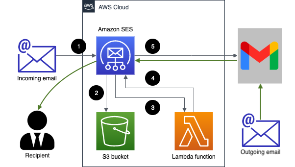
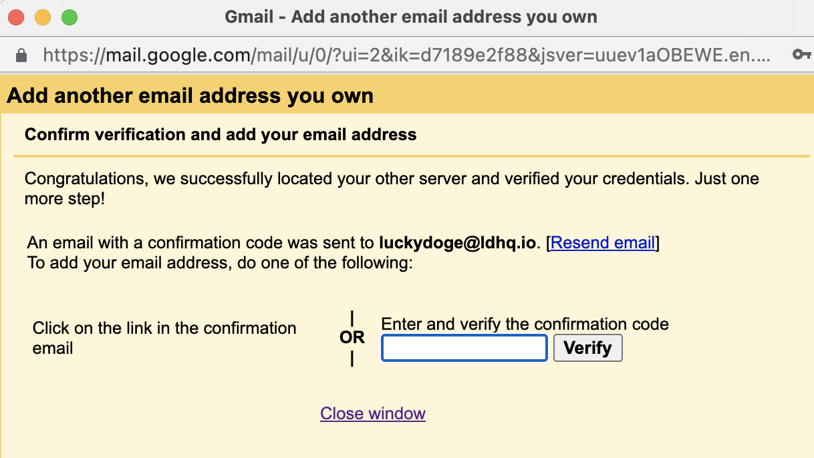
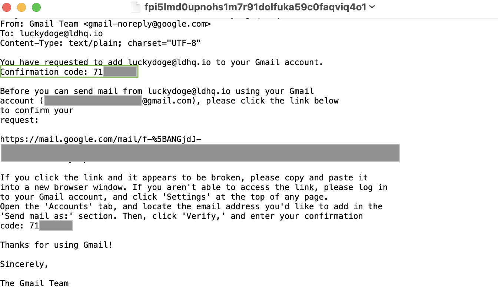

# Free* Serverless Email Service

Complete Terraform module that creates all required infrastructure for your Free* Serverless Email Server.

## The Design



In short, picture says is that we are going to use SES as our SMTP server with Receiving capability, while Gmail will act as our UI.

## AWS services involved

Whole solution is based on following AWS services:

* SES:    for domain(s) verification and routing rules
* S3:     for storing emails
* IAM:    for email user(s) creation
* Lambda: for forwarding received emails to Gmail or other email provider

Lambda code is pure [arithmetric's "aws-lambda-ses-forwarder"](https://github.com/arithmetric/aws-lambda-ses-forwarder).

## Limitations

At this time, AWS SES with "Email receiving" capability is currently supported only in following regions:

* us-east-1 (N. Virginia)
* eu-west-1 (Ireland)
* us-west-2 (Oregon)

Check [Amazon Support page](https://docs.aws.amazon.com/ses/latest/DeveloperGuide/regions.html#region-receive-email) for updates.

## Prerequisites

You will need following things ready:

* Free AWS account
* Free Gmail account
* Terraform binary [installed](https://learn.hashicorp.com/tutorials/terraform/install-cli)
* AWS CLI version 2 binary [installed](https://docs.aws.amazon.com/cli/latest/userguide/install-cliv2.html)

## Preparations

### Production SES

You will need move your SES account from "Sandbox" to "Production" state, otherwise you will be [limited to "Sandbox" environment](https://docs.aws.amazon.com/ses/latest/dg/request-production-access.html).

### Environment variables

Before you begin, following environment variables must be set:

* AWS_PROFILE
* AWS_DEFAULT_REGION
* TF_VAR_tfstate_bucket

Example:

```sh
export AWS_DEFAULT_REGION=us-east-1
export AWS_PROFILE=sandbox
export TF_VAR_tfstate_bucket=us-east-1-my-tfstate
```

**NOTE**: Create "us-east-1-my-tfstate" S3 Bucket prior moving forward.

### Terraform variables

Duplicate 'us-east-1.tfvars.example', remove '.example' and fill it up with your desired values

**NOTE**: Your tfvars file should be prefixed with the region you've provided earlier via `AWS_DEFAULT_REGION`

Example:

```sh
# export AWS_DEFAULT_REGION=us-east-1 # => my tfvars name should be "us-east-1.tfvars"
cp us-east-1.tfvars.example us-east-1.tfvars
```

Lets check core variable in `us-east-1.tfvars`:
```yaml
config = {
  "example.com" : {
    fromEmail : "sesforwarder@example.com",
    emailBucket : "us-east-1-example.com-ses",
    emailKeyPrefix : "emails/",
    forwardMapping : {
      "thedoge@example.com" : [
        "thedoge@gmail.com"
      ],
      "benita@example.com" : [
        "benita@gmail.com"
      ]
    }
  }
}
```
You'll probably want to change following variables:

* `example.com` to your domain
* `emailBucket` to desired bucket name (created by this Terraform module)
* `forwardMapping`: in this example, emails designated to your `thedoge@example.com` will be forwarded to `thedoge@gmail.com`.

   You can add up to 99 emails per domain.

You can also add multiple domains at once, example:

```yaml
config = {
  "example.com" : {
    fromEmail : "...",
    ...
  },
  "anotherdomain.com" : {
    fromEmail : "...",
    ...
  }
}
```

## Usage

### Install

```sh
# do everything from scratch automatically
make
```

### Update

```sh
# update terraform when changes were made to tfvars
make apply
```

### Uninstall

```sh
# destroy all AWS resources
make destroy
```

### Make Examples

```sh
# default stages in Makefile: stages = infra manage
make        stages=infra

# run specific task on individual stage
make init   stages=infra
make plan   stages=infra
make apply  stages=infra
make output stages=infra

# destroy everything
make destroy

# purge everything including local tfstate
make purge

# purge individual stage
make purge  stages=manage
```

Check [Makefile](./Makefile) file for all available options.

## Outputs

Outputs for both, Verification Records and SES Credentials will be placed at top level in `./outputs` folder.

Outputs example:

```bash
% tree outputs
outputs
├── 45748384954-us-east-1-dns-records.txt
└── 45748384954-us-east-1-ses-credentials.txt
```

### DNS Verification Records

Following records should be set in the DNS configuration for your domain. More information can be [found here](https://docs.aws.amazon.com/ses/latest/DeveloperGuide/send-email-authentication-dkim-easy-setup-domain.html).

```bash
% jq . outputs/45748384954-us-east-1-dns-records.txt
```
```json
{
  "example.com": {
    "dkim-0": {
      "name": "...",
      "records": "...",
      "ttl": "...",
      "type": "..."
    },
    ...
    "verification": {
      "name": "...",
      "records": "...",
      "ttl": "...",
      "type": "..."
    }
  }
}
```

### SES Credentials

```bash
% jq . outputs/45748384954-us-east-1-ses-credentials.txt
```
```json
{
  "smtp_server": {
    "name": "email-smtp.us-east-1.amazonaws.com",
    "port": "587"
  },
  ...
  "us-east-1-luckydoge@example.com": {
    "email": "...",
    "login": "...",
    "password": "..."
  }
}
```

## Email Address setup in Gmail account

Once done adding respective email address to Gmail, you will need to provide verification number, example:



In this example, your verification email will be located at `s3://us-east-1-example.com-ses/emails` folder, with unique identifier (usually its the latest email).

Download it and open with your favourite text processor and take the code:



## Being Free* solution

All counterparts heavily rely on AWS services and their Free Monthly Tiers.

Unless **abused**, your Email server should be free of charge or dirt cheap at worst case scenario.

Check Free Monthy Tiers for:

* [SES](https://aws.amazon.com/ses/pricing/)
* [S3](https://aws.amazon.com/s3/pricing/)
* [Lambda](https://aws.amazon.com/lambda/pricing/)

to estimate and calculate possible expenses.

## Contributing

Pull requests are welcome. For major changes, please open an issue first to discuss what you would like to change.

## License

[The Unlicense](./LICENSE)
